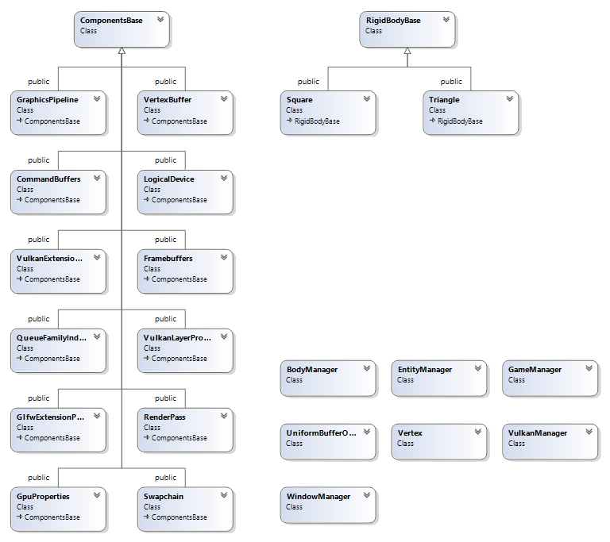

# GDD_VkEngine

This is a work in progress of creating a Vulkan-based game engine with extensive help from the Vulkan Tutorial by Alexander Overvoorde (https://vulkan-tutorial.com/).  His tutorial places everything in a single file, this is my attempt at creating an OOP-based structure from his work.

# Table of Contents
<!--ts-->
* [Installation Instructions](#installation-instructions)
* [Current State](#current-state)
* [Intended Final Solution](#intended-final-solution)
* [Next Steps](#next-steps)
* [Class Diagrams](#class-diagrams)
<!--te-->

# Installation Instructions
The only installation requirement to work with this project, is a basic Vulkan SDK installation.

<ol>
  <li>Download the Vulkan SDK at https://vulkan.lunarg.com/sdk/home</li>
  <li>Perform an installation using the default options</li>
  <li>Clone this repo</li>    
    git clone https://github.com/bkleynhans/GDD_VkEngine.git    
  <li>Compile the program in <b>64-bit</b></li>
</ol>

## --> THIS PROJECT IS BEING BUILT AND HAS ONLY BEEN TESTED ON WINDOWS USING VISUAL STUDIO 2019 <--

Please note, this is not a fully functioning engine yet.

# Current State
At this moment the master branch displays a single 2D shape on the screen.  The current WIP branch is "MultipleEntityExpansion" which is not yet working.  In this branch the square and triangle shapes have been moved into their respective classes, those have been linked to the BodyManager which in turn has been linked to the EntityManager.  

Inside the EntityManager the triangle and square objects are added to a dictionaries (maps in c++) called "vertices" and "indices" respectively.

The shapes can be displayed on the screen by referencing the individual vertices in the VertexBuffer.cpp class, however this is not the intended solution.

# Intended Final Solution
Ultimately all components will be instantiated once and added to the EntitManager "vertices" and "indices" dictionaries (maps).  Whenever the user wants to display a component on the screen, they will use instance rendering to reference a object from the EntityManager dictionaries, and "instance" the required shape on the screen.

# Next Steps
The VertexBuffer and related classes need to be updated so they can display any shape that is created within the EntityManager on screen.  My suggestion would be to continue working through the Vulkan Tutorial by Alexander Overvoorde (included in the root of the project and at his website https://vulkan-tutorial.com) from page 199, as the project currently represents the project as at page 198.

# Class Diagrams
The following diagrams constitute the current condition of the project.  Any changes that are made to the code base that influence the class diagrams need to be represented here.

## Overall Class Summary

<strong>
!!!!!!!!!!!!!!!!!!!!!!!!!!!!!!!!!!!!!!!!!!!!!!!!!!!!!!!!!!!!!! PLEASE NOTE !!!!!!!!!!!!!!!!!!!!!!!!!!!!!!!!!!!!!!!!!!!!!!!!!!!!!!!!!!!!!!

&nbsp;&nbsp;&nbsp;&nbsp;&nbsp;&nbsp;&nbsp;&nbsp;&nbsp;&nbsp;&nbsp;This project IS NOT EXACTLY THE SAME as the project in the tutorial.  The tutorial uses a single-file layout while this project has been broken down into multiple classes.  The tutorial was used to create this engine, however it was used as a reference only.  

!!!!!!!!!!!!!!!!!!!!!!!!!!!!!!!!!!!!!!!!!!!!!!!!!!!!!!!!!!!!!!!!!!!!!!!!!!!!!!!!!!!!!!!!!!!!!!!!!!!!!!!!!!!!!!!!!!!!!!!!!!!!!!!!!!!!!!!!!!!!!!!!!!
</strong>

